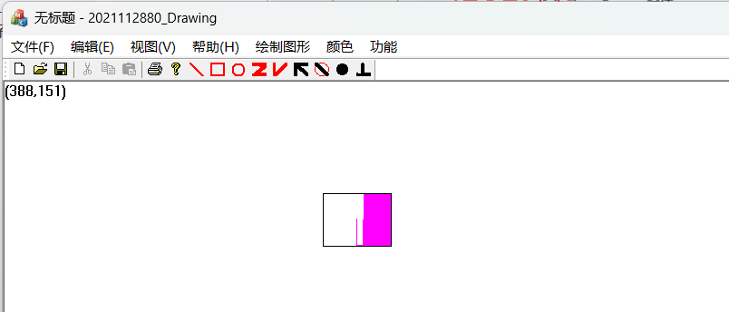
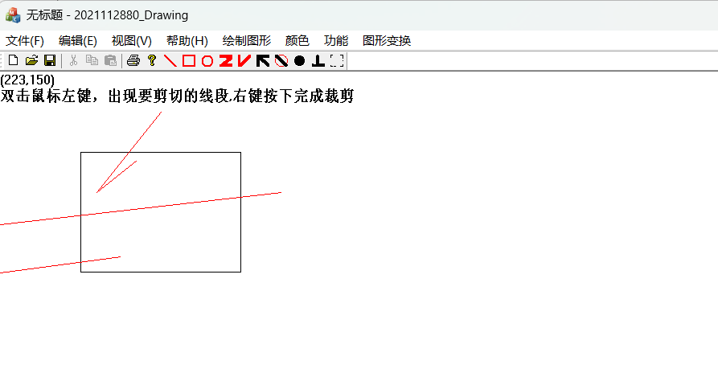

# 使用介绍（图形变换，实现了矩形的平移，缩放，旋转，圆、直线段的平移，缩放）

## 界面介绍

## 中点画线，Bresenham法画圆，B-SplineCurve，简单种子填充，扫描种子填充

## 功能介绍及演示

### 1.画直线，矩形，圆形，鼠标左键点击工具栏对应图标，或者在顶部导航栏选择对应按钮。

### 鼠标左键按下确定一个起点，常按左键移动图形，左键抬起确定最终图形。

### 2.画多义线，通过多义线画三角形（更新）

#### 鼠标右键点击确定绘制结束。画三角形时将第三条边的终点靠近顶点即可。

### 3.画曲线

#### 左键双击确定起点，再次双击确定中间，按住鼠标左键移动来绘制曲线，鼠标右键按下，结束绘制。如果还想继续绘制曲线，需要再次选择。从起点到终点是逆时针绘制的，可以通过控制起点，终点的选择顺序来控制曲线开口方向。

### 4.选择功能

#### 鼠标左键点击工具栏对应图标，或者在顶部导航栏选择对应按钮，右键按下结束选择。

### 5.求交点

#### 鼠标要先开启选中再点击求交功能，左键点击两直线，得出交点坐标,左上角的鼠标位置坐标用来验证左下角输出的交点坐标。

### 6.求圆心：

#### 选中，鼠标左键点击圆

### 7.绘制垂线

选中绘制垂线功能后，鼠标左键选中一个点，选择对应直线会绘制从选中点到直线的垂线。

### 8.保存文件，打开文件

保存为无格式文件；选择文件打开。

### 9.填充

使用方法：变成选择状态，点击填充方法，右键设置填充点，进行填充（填充未结束时，切记乱动）（默认填充颜色为紫色）

- **简单种子填充**

- **扫描种子填充**

​          

### 10.B-SplineCurve

使用方法：左键点击设置三个控制点，左键按下不动拖动鼠标绘制曲线，右键按下绘制结束。

### 11.Bezier（现控制点最多为10个）

### 12.BSpline-3（六个控制点）

绘制方式与Bezier一样，但必须要有六个控制点

### 13.图形变换

#### 直线段：

##### 平移：

##### 缩放：（每次最多缩小一半，存在误差，线段会偏移）

#### 圆形：平移、缩放，与直线段类似。

#### 矩形：

##### 平移：

##### 缩放：

##### 旋转：

### 14.裁剪

#### 区域裁剪并放大：（鼠标左键点击）

#### 固定区域线段裁剪：

